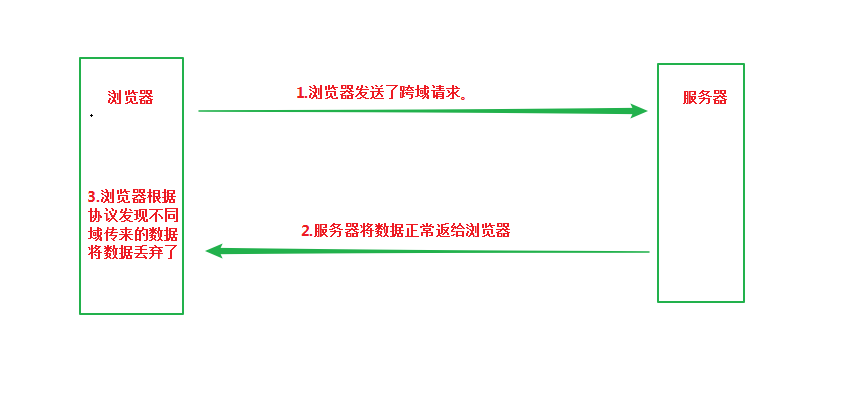

### 参考文档
[django-rest-framework](https://www.django-rest-framework.org/tutorial/quickstart/#quickstart)

```
python3 manage.py migrate
```

```
python manage.py createsuperuser --email admin@example.com --username admin
```
> password123

> http://127.0.0.1:8000/users/


### snippets应用
```
python3 manage.py startapp snippets
```

```
python3 manage.py makemigrations snippets
python3 manage.py migrate
```

# 跨域

跨域不是服务器不给数据，也不是浏览器发现了跨域，不进行请求。
而是浏览器默认将请求的来自不同源的数据丢弃了，从而保护用户权益

可以手动在响应头部添加申明字段
```
response.headers["Access-Control-Allow-Origin"] = "http://127.0.0.1:5000" # 允许来自http://127.0.0.1:5000的服务请求资源
```

```
# django中使用csrf_exempt装饰器处理跨域请求
from django.views.decorators.csrf import csrf_exempt

@csrf_exempt
def wechat_auth(req):
    pass
```